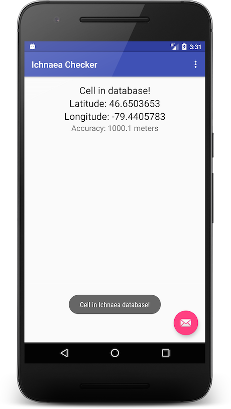

Ichnaea Checker
===============

A stupid simple Android app that checks your cell network is in Mozilla's Location Services database.

Next Steps
----------

1. Display full cell details of cell in question
2. Check neighbouring cells too
3. Plot them on a map, maybe
4. Update the UI to not be balls
5. Test stuff I guess
