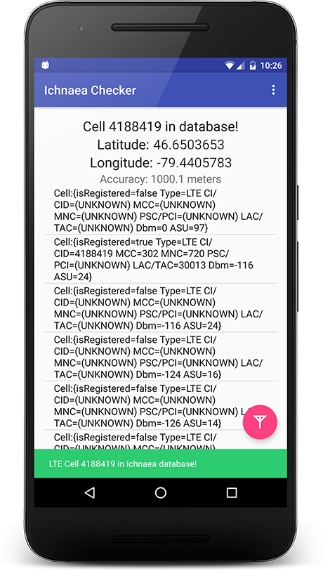

Ichnaea Checker
===============

A stupid simple Android app that checks your cell network is in Mozilla's Location Services database.

Next Steps
----------

1. Plot cells on a map, maybe
2. Update the UI to not be balls
3. Implement CDMA fallbacks
4. Test stuff I guess
